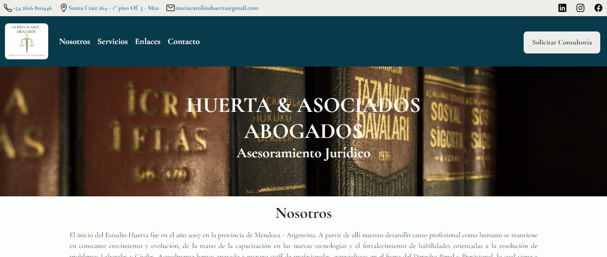

# Estudio Jurídico Huerta y Asociados

Este proyecto es el sitio web del Estudio Jurídico Huerta & Asociados ubicado en la ciudad de Mendoza - Argentina.

El sitio es responsive y está realizado con HTML, CSS y SASS.

## Clonar el repositorio:

Si quieres tener una copia del Proyecto debes clonar el repositorio en tu laptop o pc de escritorio y ejecutar algunas acciones que se indicarán a continuación para poder visualizarlo, hacer pruebas y por qué no, obtener algunas ideas para tu proyecto.

Para clonar el repositorio, ingresa el siguiente comando en tu consola:

### $ git clone (link del repositorio)

## Para comenzar

Una vez clonado el repositorio, podrás visualizar el sitio haciendo doble click en index.html

## Navegación

A continuación podrán ver la navegación del sitio web

https://www.loom.com/share/afea10f3ad8f4aa0878db801893f558b

## Deployment

Podrás acceder directamente desde github pages con el siguiente link: [https://pablomilitello.github.io/EstudioJuridicoHuerta-Asociados/](https://pablomilitello.github.io/EstudioJuridicoHuerta-Asociados/)

## Web en producción

[http://www.huertayasociados.com.ar/](http://www.huertayasociados.com.ar/)
